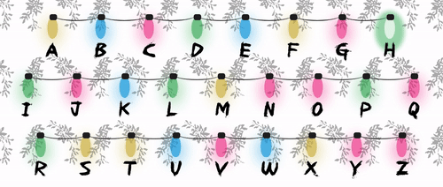

# Stranger Sweater 👻

## Contents
1. [Description](#Decription)
2. [Features](#Features)
3. [Technologies](#Technologies)
4. [Challenges and Solutions](#Challenges-and-Solutions)
5. [Screenshots](#Screenshots)
6. [Sweater-Code](#Sweater-Code)
7. [Installation](#Installation)

## Decription
Built for fans of Stranger Things, Stranger Sweater is two projects[**](#Sweater-Code) in one. The Sweater is studded with lights that blink out your message. The controlling interface is a stylish <a href="https://strangersweater.com">web app</a> where you can send/see spelled out messages anywhere in the world. That's one spooky ugly Christmas sweater! 👻🎄

### Features
* 26 individually addressable LEDs blink to spell out messages sent from the <a href="https://strangersweater.com">web application.</a>  
  * A web version of the sweater blinks to spell out the same messages, recreating the same experience digitally!
* Physical sweater connects to the Node/Express server to get the latest message.
* Bisected design of "Alphabet Wall" and "Upside Down" halves recreate the iconic scenes from Stanger Things, Season One. 
* Animation rich experience web experience adds delight at every turn. 
  * Title is fully animated using only HTML and CSS. 
  * On the Desktop version of the site, dusty motes swirl around the "Upside Down" half of the site.

## Technologies
* React (+ React Hooks 🎣)
* HTML
* CSS
* Javascript
* Node.js
* Express
* Python [**](#Sweater-Code)
* Raspberry Pi [**](#Sweater-Code)

## Challenges and Solutions
* iOS. 👊📱👊 
  * My daily device is an iPhone and developing a responsive site that rendered correctly on iOS proved frustrating at times. My primary technique was to create a design based primarily on view-widths and heights. Many elements (title included) are full responsive as a result. This meant there was no need to create media queries for breakpoints.
  * However, if a solution was too costly to develop in my tight timeline, I use a media query to target iOS and selectively disable troublesome features. For example, behaviors of a few of the animations, such as the swirling dust motes in the "Upside Down," did not render properly. In the interest of delivering on time, they have been removed from the iOS experience. (For now. 😉)

* `::before` / `::after` 👯
  * Many of the core styles of the site depend on `::before` and `::after` pseudo elements. For example, the strings of flashing lights are completely constructed out of pseudoelements based on `<li>` elements. As these do not represent true DOM elements, it made it more difficult to target and alter them in JavaScript. Creatively, adding and removing class names became my primary strategy for mutating CSS attributes of psudeo elements.

## Screenshots
* Animations

* Mobile
  * &nbsp;&nbsp;&nbsp; "Alphabet Lights Wall"  "Upside Down" Input Area
  
  *  &nbsp; 

## Sweater Code
As mentioned, this is two projects in one. Because the hardware requires a python script to drive the LEDs and make request to this server, the code is split into a separate repository found <a href="https://github.com/ray-jonathan/stranger-sweater">here.<a> There, you can find more discussion on the construction of the sweater and how it relates to the requirements on the code accordingly.

## Installation ⁉️
Okay, so for some reason, even though you don't have my sweater, you want to run your own version on my server/app? Okay, if you insist... the architecture of this is a little funny so bear with me:
1. `git clone` this repo.
2. `npm install` the dependencies. If you peeked, you'll notice there are actually two package.json files. 🙈 That's because I put the React application inside this Node/Express repo. Don't worry, the amount of overhead is minimal, I swear, and I've got a handy script for you to ease things.
* `mkdir public`. 👼 Just trust me, this is to make the script later easier on you. 
3. `cd react` to switch into the react application. You'll probably need to `npm install` here too, sorry bud. 💩
4. From the /react directory, `npm run build`. This is that handy script I was promising you. It'll harness webpack to tree-shake, build, whatever, and then move the files we need into the folder Express wants.
5. `cd ..`
6. Congrats, you're ready to run you node/express server with `node index.js`. Without changing the routes in the React application, you'll be querying my API, ya weirdo. 😬
